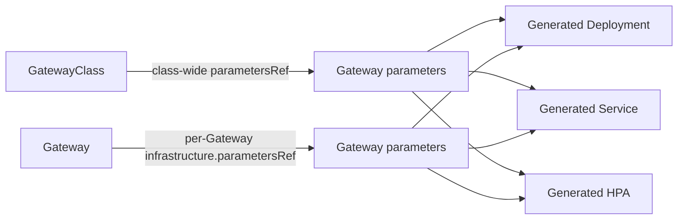

# Gateway API customization in OpenShift

This is a working design notebook for deciding how OpenShift should customize the infrastructure behind a Gateway.

Gateway API standardizes traffic intent. Implementations still need a controlled way to configure the resources that make a Gateway run: proxy Deployments, resource requests, replicas, autoscaling, Services, scheduling, environment variables, and readiness behavior.

## Explore the wireframe

- [Implementation survey](implementation-survey.md): how Cilium, Istio, kgateway, Envoy Gateway, GKE, NGINX Gateway Fabric, Traefik, and Kong expose customization.
- [Decision framework](decision-framework.md): work from API necessity through attachment, schema, and field-level decisions.
- [Complete design bundles](design-bundles.md): compare coherent end-to-end designs after the individual decisions.
- [OpenShift design options](design-options.md): reuse `IngressController` or create a typed `GatewayParameters` API.
- [Deep dive: `externalTrafficPolicy`](deep-dives/external-traffic-policy.md): source-IP preservation, local endpoints, MetalLB, and BGP/anycast.
- [Deep dive: `ClusterIP`](deep-dives/cluster-ip.md): internal Gateway Services versus routing through backend Service VIPs.
- [References](references.md): source documentation used by the survey.

## Working hypothesis

OpenShift should probably expose a typed parameters resource for common operational controls, attachable from both `GatewayClass` and `Gateway`, with a carefully bounded extension mechanism for fields that cannot be anticipated.

