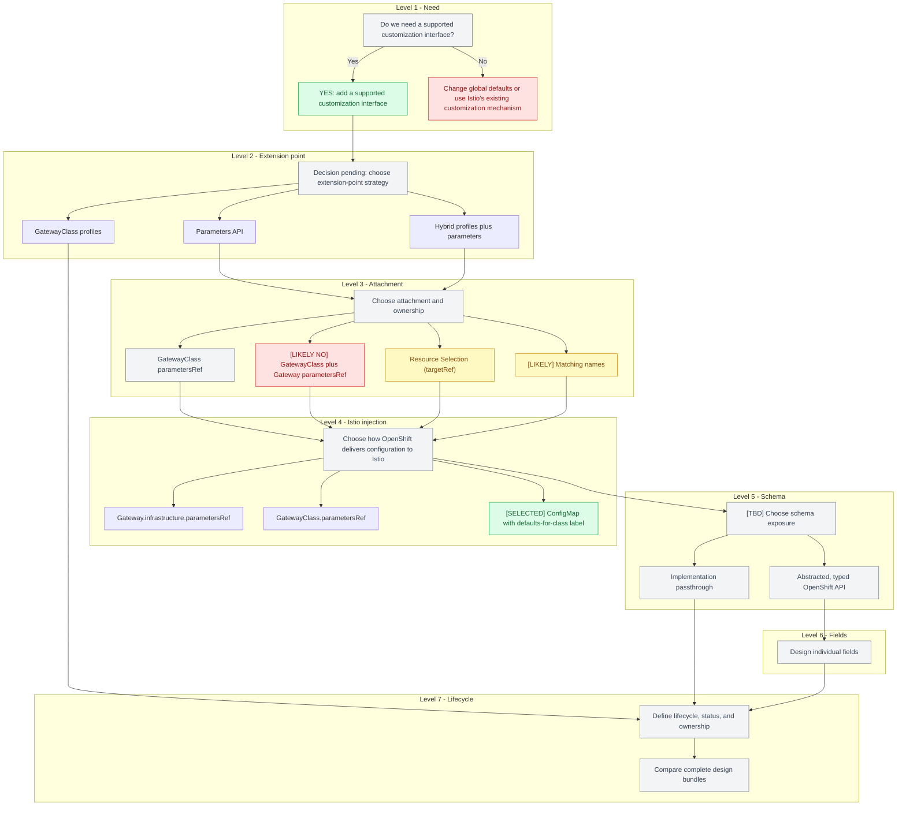

# Design decision framework

The design should be discussed as a sequence of decisions. Each level narrows the choices below it.

Decision markers: `[YES]` selected, `[SELECTED]` current direction, `[LIKELY]` leaning, `[LIKELY NO]` leaning away, and `[TBD]` undecided.



The GatewayClass profiles branch is discussed in the [Gateway API implementation-specific GatewayClass proposal](https://github.com/openshift/enhancements/pull/1990).

---

## Level 1 — Do we need a supported customization interface?

**Decision: supported customization interface**

The likely answer is yes. OpenShift owns and reconciles generated Deployments, Services, HPAs, and related resources. An API gives users supported fields, validation, and implementation independence.

`ClusterIP` and `externalTrafficPolicy` might be handled through Service-specific workarounds, but that creates unclear ownership and reconciliation behavior. They should be evaluated as API fields even if some implementations can support them indirectly.

---

## Level 2 — Where does customization enter Gateway API?

**Decision: extension-point strategy**

| Option | Meaning |
| --- | --- |
| Parameters API | Use `GatewayClass.spec.parametersRef` and `Gateway.spec.infrastructure.parametersRef`. |
| GatewayClass profiles | Offer predefined classes such as internal, external, or high-availability. |
| Hybrid | Use profiles for broad operating modes and parameters for supported overrides. |

**Status: TBD.**

“GatewayClass enumeration” is better described as **GatewayClass profiles**. It is a preset strategy, not a general customization API.

---

## Level 3 — How is the configuration attached?

**Decision: attachment and ownership**

The main options are:

| Option | Meaning |
| --- | --- |
| GatewayClass `parametersRef` | The `GatewayClass` points to class-wide parameters. |
| GatewayClass plus Gateway `parametersRef` | The class provides defaults and the Gateway provides per-Gateway overrides. **Likely not selected.** |
| Resource Selection (`targetRef`) | The customization object points to a `Gateway` or `GatewayClass` using a reference or selector. |
| Matching names | A convention such as `GatewayCustomization/<GatewayClass name>` selects the target. **Likely.** |

**Status: Resource Selection and Matching Names are the current alternatives.**

The GatewayClass-only model is:

```text
GatewayClass.parametersRef -> class-wide defaults
```

The two-level model is:

```text
GatewayClass.parametersRef            -> class-wide defaults
Gateway.infrastructure.parametersRef -> one Gateway’s overrides
```

OpenShift should read these references rather than mutate the user’s Gateway. That avoids GitOps drift. Name matching and label-based discovery can remain implementation details if needed for Istio translation.

With Resource Selection, the customization object owns the relationship:

```yaml
kind: GatewayCustomization
spec:
  targetRef:
    kind: Gateway
    name: internal
```

This can be useful when the customization must be managed by a platform namespace, but it raises cross-namespace authorization questions. Mutating the Gateway to add a generated `parametersRef` can also create GitOps drift.

---

---

## Level 4 — How does OpenShift inject configuration into Istio?

This is an internal implementation decision, separate from the public attachment model.

OpenShift can deliver the translated configuration to Istio through:

| Istio mechanism | Use |
| --- | --- |
| `Gateway.spec.infrastructure.parametersRef` | Per-Gateway configuration. |
| `GatewayClass.spec.parametersRef` | GatewayClass-level configuration, if supported by the Istio integration. |
| ConfigMap with `gateway.istio.io/defaults-for-class` | Istio’s class-default mechanism. **Selected direction.** |

The OpenShift API should hide this choice. The current direction is for OpenShift to create or update the class-default ConfigMap and apply the `gateway.istio.io/defaults-for-class` label.

---

## Level 5 — What kind of API is exposed?

**Decision: schema exposure**

| Option | Tradeoff |
| --- | --- |
| Passthrough | Flexible, but exposes Istio/generated-resource details. |
| Abstracted, typed API | Safest and most portable, but requires fields for each supported use case. |

**Status: TBD.** The main choice is still between an abstracted, typed OpenShift API and exposing implementation details. The current constraints favor an abstracted API; users should not patch generated Istio or Kubernetes resources.

---

## Level 6 — How is each field designed?

For every field, record:

- user intent;
- generated resource and Kubernetes field;
- proposed OpenShift field;
- scope: GatewayClass, Gateway, or both;
- defaults and validation;
- mutability and replacement behavior;
- ownership and status reporting.

Suggested field groups:

- capacity: replicas, resources, HPA;
- placement: node selectors, affinity, tolerations;
- Service: type, `ClusterIP`, `NodePort`, traffic policies;
- health: readiness, liveness, external health checks;
- process: environment variables and logging.

See the [field deep dives](deep-dives/external-traffic-policy.md) for examples.

---

## Level 7 — What are the complete designs?

After the individual decisions, compare complete bundles in [design bundles](design-bundles.md). This keeps one design from hiding several unrelated choices.
