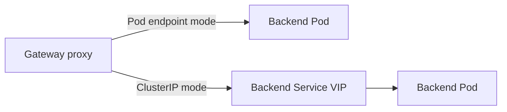

# Deep dive: `ClusterIP`

“ClusterIP support” has two different meanings.

## 1. The Gateway frontend Service is `ClusterIP`


This creates an internal-only Gateway. It is useful for east-west traffic, internal APIs, and a Gateway that sits behind another load balancer.

The API question is whether the generated proxy Service supports:

```yaml
spec:
  service:
    type: ClusterIP
```

## 2. The proxy sends backend traffic to a Service ClusterIP

Many implementations normally resolve a backend Service to Pod endpoints. A `useClusterIP`-style setting instead makes the proxy send traffic to the Service VIP.



This can be useful for service mesh interception or when kube-proxy should own backend load balancing. The tradeoff is that proxy-level endpoint selection and load-balancing behavior may no longer apply.

## OpenShift questions

- Should an internal Gateway be represented by a `ClusterIP` Service or by a separately managed frontend?
- Should frontend Service type and backend resolution be separate fields?
- Should `ClusterIP` permit a manually assigned `clusterIP`?
- How should status addresses be reported for an internal Gateway?
- Should a Gateway with `ClusterIP` be allowed to serve cross-namespace routes?

