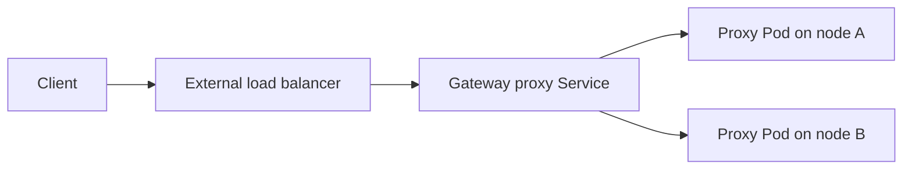

# Deep dive: `externalTrafficPolicy`

## What it controls

`externalTrafficPolicy` is a field on the Kubernetes Service that exposes the Gateway proxy.



With `Cluster`, a node may forward traffic to an endpoint on another node. With `Local`, a node sends traffic only to local endpoints and can preserve the original source address, but traffic sent to a node without a local endpoint can fail.

## Why Gateway implementations expose it

The generated proxy Service is part of the Gateway’s infrastructure. A platform may need `Local` for:

- source-IP preservation;
- MetalLB behavior;
- BGP or anycast advertisements;
- external load balancers that health-check individual nodes;
- avoiding a second cross-node hop.

It is usually a property of the generated Service, not of an `HTTPRoute`.

## API placement options

### Typed Service field

```yaml
spec:
  service:
    externalTrafficPolicy: Local
```

This is easy to validate and explain. It should be rejected or ignored when the generated Service type cannot use the field meaningfully.

### Service patch

```yaml
spec:
  patches:
  - target: Service
    patch: |
      spec:
        externalTrafficPolicy: Local
```

This is flexible, but makes the generated Service part of the supported customization interface.

## OpenShift questions

- Should the setting be allowed at GatewayClass scope only, or also per Gateway?
- Should `Local` require an exposed readiness or health-check port?
- Should the operator warn when `Local` is selected but proxy placement makes local endpoints unlikely?
- Should the field be inherited from an existing OpenShift endpoint-publishing policy?
