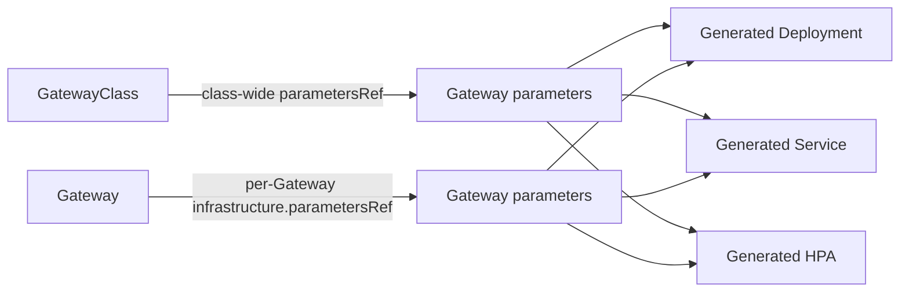

# Gateway API customization in OpenShift

> A working design notebook for deciding how OpenShift should customize the infrastructure behind a Gateway.

## What this explores

Gateway API standardizes traffic intent. Implementations still need a controlled way to configure the resources that make a Gateway run:

- proxy Deployments and resource requests;
- replicas and autoscaling;
- Service type and `externalTrafficPolicy`;
- environment variables and pod scheduling;
- readiness behavior and platform-specific integration.

This collection compares existing implementations and sketches API options for OpenShift.

## Start here

| Page | Question | Status |
| --- | --- | --- |
| [Implementation survey](implementation-survey.md) | How do other Gateway implementations expose customization? | Draft |
| [Decision framework](decision-framework.md) | What decisions should the team make, and in what order? | Draft |
| [Complete design bundles](design-bundles.md) | What do the end-to-end options look like? | Draft |
| [OpenShift design options](design-options.md) | What API shapes could OpenShift use? | Draft |
| [Deep dive: `externalTrafficPolicy`](deep-dives/external-traffic-policy.md) | Where should source-IP and local-endpoint behavior be configured? | Draft |
| [Deep dive: `ClusterIP`](deep-dives/cluster-ip.md) | What does “support ClusterIP” mean for a Gateway? | Draft |

## The basic model

## Working hypothesis

OpenShift should expose a typed parameters resource for supported operational controls. Generated-resource patches remain an internal implementation detail, and users configure the OpenShift API rather than Istio directly.

## References

The survey is based on the implementation documentation collected in [references.md](references.md).
